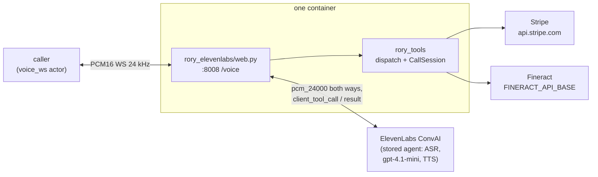

# rory-elevenlabs

Rory, a customer-service voice agent for Acme Energy, built on **ElevenLabs
Conversational AI** — a managed platform: ASR, the `gpt-4.1-mini` LLM,
`eleven_flash_v2` TTS and turn-taking all run on ElevenLabs' side behind a
stored *agent*. Rory explains bills, takes payments, and sets up payment
arrangements end to end, calling **two real vendor APIs** — Stripe for billing
and Apache Fineract for payment arrangements. The agent terminates a `voice_ws`
channel (raw PCM16 over a plain WebSocket) directly — no SFU, no WebRTC, no
separate bridge process.

Unlike the [Pipecat implementation](../pipecat/) there is no STT/LLM/TTS
pipeline to assemble, and unlike [Gemini Live](../gemini-live/) the prompt and
tools are not sent per session: they live on the stored agent. What this
implementation adds is the provisioning of that agent, the `voice_ws` bridging,
and the adapter that registers Rory's shared tools as ElevenLabs *client
tools* — calls the hosted LLM makes come back down the conversation socket and
resolve in this process, so no inbound webhook is needed and no
`OPENAI_API_KEY` either.

Only the transport lives here. The tools, the vendor clients, the verification
gate and the system prompt are shared with the other implementations and live
at the repo root — see the layout section in the [root README](../README.md).

## What it does

One process runs inside the container: uvicorn serving `rory_elevenlabs/web.py`,
which exposes `WS /voice` (plus `/health`) on `:8008`.

At boot, `agent.py:ensure_agent` resolves the stored agent — `AGENT_ID` if set,
otherwise it creates one from the shared prompt plus the frozen-clock date
context, `first_message` set to the shared greeting, the 16 tools as client
tools, and `pcm_24000` audio on both legs. This happens before `/health`
answers, so a missing key or a rejected config fails the pod rather than each
call.

Each `/voice` connection then opens its own `AsyncConversation` against that
agent, binds the tool handlers to a fresh `CallSession`, and bridges audio in
both directions through an `AsyncAudioInterface`. Rory speaks first.



## Sample rates and turn-taking

The Veris actor speaks and listens at **24 kHz** PCM16. The ElevenLabs audio
interface carries whatever format the agent was provisioned with (the SDK's
docstring says 16 kHz, but that is the platform default, not a constraint), so
the agent is created with `pcm_24000` on both legs and audio passes through
untouched in both directions. A pinned `AGENT_ID` must have been created the
same way.

**Turn-taking cannot be matched.** The Pipecat and Gemini Live candidates land
at ~0.8 s of effective end-of-turn silence. ElevenLabs' endpointing is its own
learned turn model and exposes no silence threshold to pin; `turn_timeout` is an
inactivity re-prompt, not the per-utterance endpoint. `turn_eagerness` is pinned
to the default so the setting is explicit, but a score difference on
interruption or latency against this candidate includes the vendor's turn
model, not only its voice stack.

Tool calls are executed **sequentially**. The SDK schedules every
`client_tool_call` as its own task, so two calls in one turn would otherwise run
side by side against the same verification and payment state; a per-call lock
keeps them in the order the model emitted them.

## What it shares with the other candidates

Everything except the transport, by construction:

| Shared | Where |
|---|---|
| The 16 tools, their descriptions and required arguments | `rory_tools/schemas.py` |
| Their implementations, and the verification gate | `rory_tools/impl.py`, `rory_tools/dispatch.py` |
| Stripe and Fineract clients | `rory_tools/services/` |
| System prompt, opening line, frozen-clock date context | `rory_tools/agent_desc.txt`, `rory_tools/prompt.py` |

`tests/test_parity_elevenlabs.py` asserts the tool declarations uploaded to the
agent and the prompt it carries are the shared ones, so a divergence fails the
suite rather than quietly becoming a benchmark result.

## Running it

`elevenlabs/Dockerfile` builds the image from the repo root; see its header
for the build command. Set on the candidate:

```
ELEVENLABS_API_KEY=...
# optional: AGENT_ID, ELEVENLABS_LLM, ELEVENLABS_TTS_MODEL, ELEVENLABS_VOICE_ID
```

Without `AGENT_ID` every boot creates a fresh agent on the platform and logs its
id. Pin it to reuse the stored agent — but note that a pinned agent keeps
everything it was created with: the model and voice env vars, and the date
context in its prompt.

## Tests

The suite lives at the repo root:

```bash
cd .. && uv run pytest -q
```

## Environment

| Variable | Default | Role |
|---|---|---|
| `ELEVENLABS_API_KEY` | — | Required. The ConvAI platform credential; ASR, LLM and TTS all run behind it. |
| `AGENT_ID` | (created at boot) | Pin a stored agent instead of creating one per boot. |
| `ELEVENLABS_LLM` | `gpt-4.1-mini` | Creation-time only. |
| `ELEVENLABS_TTS_MODEL` | `eleven_flash_v2` | Creation-time only; English ConvAI agents reject the v2_5 / v3 variants. |
| `ELEVENLABS_VOICE_ID` | `EXAVITQu4vr4xnSDxMaL` | Sarah. Creation-time only. |
| `STRIPE_API_KEY` | — | Sandbox fixture; the billing twin's credential. |
| `FINERACT_USER` / `FINERACT_PASSWORD` / `FINERACT_TENANT` | `mifos` / `password` / `default` | Fineract's public OSS defaults. |

The opening line is the agent's `first_message`, voiced verbatim by TTS like
the Pipecat candidate. Offline checks cover schemas, instructions and the
client-tool round trip; the audio legs and the hosted turn model need a live
call.
