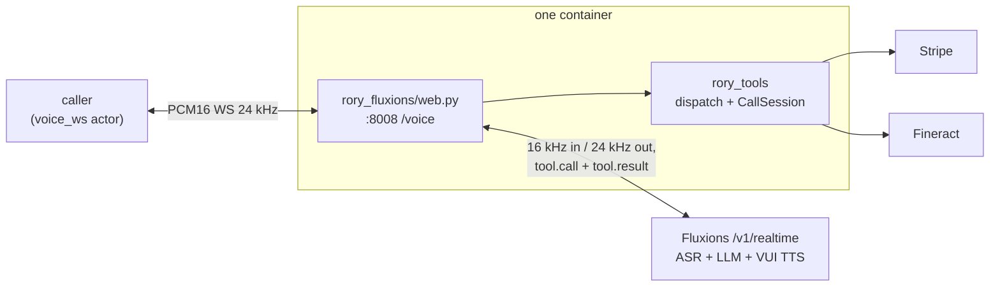

# rory-fluxions

Rory, a customer-service voice agent for Acme Energy, built on the
**[Fluxions voice-agent API](https://fluxions.ai/docs)** — one
`WS /v1/realtime` socket that carries Fluxions's ASR, its end-of-utterance
model, a vLLM-served chat model, and VUI TTS as a single session, with Rory's
tools declared as bring-your-own functions the server asks this process to
run. Rory explains bills, takes payments, and sets up payment arrangements end
to end, calling **two real vendor APIs** — Stripe for billing and Apache
Fineract for payment arrangements. A single FastAPI process terminates the
`voice_ws` channel (raw PCM16 over a plain WebSocket) and bridges it to the
Fluxions session.

Only the transport lives here. The tools, the vendor clients, the verification
gate and the system prompt are shared with the other implementations and live
at the repo root — see the layout section in the [root README](../README.md).

## What it does

One process runs inside the container: uvicorn serving `rory_fluxions/web.py`,
which exposes `WS /voice` (plus `/health`) on `:8008`. Each `/voice` connection
opens its own Fluxions realtime socket, sends one `session.update` (the shared
prompt plus today's date as the `soul`, the 16 tools from `rory_tools.SCHEMAS`,
the voice, and the knobs below), then runs the bridge in
`rory_fluxions/agent.py`: caller PCM16 → Fluxions mic, and Fluxions's mixed
stream — binary agent speech, JSON events — → paced audio to the actor plus
tool dispatch through `rory_tools.dispatch`. Rory speaks first.



Like Gemini Live, OpenAI Realtime and Deepgram, Fluxions *is* the whole voice
loop — there is no STT/LLM/TTS pipeline to assemble here. Things worth knowing
about how the API shapes the bridge:

- **The greeting is not the model's.** `greet: false` suppresses Fluxions's own
  opening line; the shared greeting is rendered once at startup through
  `POST /v1/tts` and spoken from that buffer on every connect, like Pipecat's
  TTS'd greeting. The shared prompt already tells the model it has greeted.
- **Only the mic leg is resampled.** Fluxions listens at a strict 16 kHz — audio
  at any other rate is not rejected, it transcribes badly — so the actor's 24 kHz
  frames are downsampled (`audioop.ratecv`, state carried across frames) and
  forwarded one by one, silence included: the server's endpointing needs the
  continuous timeline to hear the caller stop. Agent speech arrives at 24 kHz
  and goes to the actor untouched. `session.created` announces both rates and
  the bridge checks them.
- **Agent audio is paced, not blasted.** Fluxions delivers speech ~6× faster
  than realtime, and nothing sent to the actor can be clawed back. The bridge
  holds the reply in a queue and sends it no more than 1 s ahead of playback,
  reports `playback.pos` every 250 ms, and drops the queue on `audio.flush` —
  which is what makes a barge-in actually cut the reply short.
- **Tool calls round-trip to this process.** A `tool.call` event is dispatched
  through the shared gate on a worker thread and answered with a `tool.result`
  carrying the same `call_id`, sequentially, because calls share verification
  and payment state. Fluxions gives the result 12 s before telling the caller
  the action did not happen. Routing is prompted from the tool *description*,
  which is one more reason the descriptions are shared and unedited.
- **Turn-taking is Fluxions's own.** Its end-of-utterance model commits a turn
  after an adaptive 0.3–1.5 s of silence and exposes no knob, so unlike the
  Pipecat and Gemini Live candidates — which pin ~0.8 s — this agent runs
  whatever the server decides.
- **The agent may not hang up, or nag.** `allow_hangup: false`, and the idle
  check-in and idle hangup — which fire by default after ~15 s of caller
  silence — are pushed out to an hour. A scored call ends when the caller's
  side closes, as with every other candidate. `echo_guard` is off because
  injected PCM has no acoustic loopback.
- **The host decides whether a credential is sent.** `GET /config` reports
  `auth_required`; when set, `FLUXIONS_API_KEY` must be present and rides as
  a bearer on REST and as `token` on the socket. When not, nothing is sent:
  an anonymous deployment answers 401 to any bearer it did not issue, so an
  unneeded key would fail the boot rather than be ignored.
- **Three things fail the boot, not the call.** A host that requires auth and
  no `FLUXIONS_API_KEY`; a prompt longer than the host's `max_soul_chars`,
  which it would otherwise truncate silently and run Rory on a fraction of
  the policy; and a voice not in `GET /voices`. All stop `/health` from
  answering, so the bench never dials a misconfigured agent.

## Tests

```bash
cd .. && uv run pytest fluxions/tests -q     # this transport's parity and lifecycle run
cd .. && uv run pytest -q                    # the whole workspace
```

## Environment

| Variable           | Required | Default                       | Notes |
|--------------------|----------|-------------------------------|-------|
| `FLUXIONS_API_KEY` | host     | —                             | required when the host's `GET /config` reports `auth_required`; then sent as `token` in `session.update` and as a bearer on REST. An anonymous host gets no credential — it rejects any bearer it did not issue |
| `FLUXIONS_HOST`    | yes      | —                             | the deployment's host; `wss://<host>/v1/realtime` and the REST paths hang off it |
| `STRIPE_API_KEY`   | yes      | —                             | the Stripe twin's fixture key |
| `FLUXIONS_VOICE`   | no       | `maeve`                       | a `voice_id` from `GET /voices` |

Plus the shared `STRIPE_API_BASE`, `FINERACT_API_BASE`, `RORY_REFERENCE_TIME`
and Fineract variables the bench injects — see the Pipecat README.
