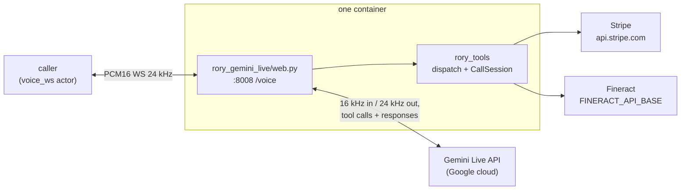

# rory-gemini-live

Rory, a customer-service voice agent for Acme Energy, built on the **Gemini
Live API** (speech-to-speech, server-to-server via the
[`google-genai`](https://pypi.org/project/google-genai/) SDK). Rory explains
bills, takes payments, and sets up payment arrangements end to end, calling
**two real vendor APIs** — Stripe for billing and Apache Fineract for payment
arrangements. The agent terminates a `voice_ws` channel (raw PCM16 over a plain
WebSocket) directly — no SFU, no WebRTC, no separate bridge process.

Unlike the [Pipecat implementation](../pipecat/) there is no STT/LLM/TTS
pipeline to assemble: Gemini Live *is* the whole voice loop. What this
implementation adds is the `voice_ws` bridging (sample-rate conversion,
turn-taking threshold) and the adapter that hands Rory's shared tools to Gemini.

Only the transport lives here. The tools, the vendor clients, the verification
gate and the system prompt are shared with the
other implementations and live at the repo root — see the layout section in the
[root README](../README.md).

## What it does

One process runs inside the container: uvicorn serving `rory_gemini_live/web.py`,
which exposes `WS /voice` (plus `/health`) on `:8008`. Each `/voice` connection
opens its own Gemini Live session (`gemini-2.5-flash-native-audio-preview-12-2025`,
voice `Puck` by default), registers Rory's 16 tools, and bridges audio and
function calls in both directions. Rory speaks first.



## Sample rates and turn-taking

The Veris actor speaks and listens at **24 kHz** PCM16. Gemini Live is fixed at
**16 kHz input / 24 kHz output**, so the inbound leg is downsampled 24 kHz →
16 kHz (stdlib `audioop.ratecv`, with resample state carried across frames) and
Gemini's output is forwarded back unchanged.

**Gemini's own VAD** is pinned to `silence_duration_ms=800` /
`prefix_padding_ms=300`. That is not an arbitrary choice: the Pipecat candidate
lands at ~0.8 s of effective end-of-turn silence (0.2 s Silero `stop_secs` plus
a 0.6 s speech timeout), and Gemini's unset server default is undocumented.
Gemini keeps its own VAD *model* — only the threshold is matched — so the two
candidates differ in how they detect the end of a turn, but not in how long
they wait, which is the variable that would otherwise swamp any comparison of
interruption and latency.

## What it shares with the Pipecat candidate

Everything except the transport, by construction:

| Shared | Where |
|---|---|
| The 16 tools, their descriptions and required arguments | `rory_tools/schemas.py` |
| Their implementations, and the verification gate | `rory_tools/impl.py`, `rory_tools/dispatch.py` |
| Stripe and Fineract clients | `rory_tools/services/` |
| System prompt, opening line, frozen-clock date context | `rory_tools/agent_desc.txt`, `rory_tools/prompt.py` |

`tests/test_parity_gemini_live.py` asserts the tool surface and prompt this
agent presents are the shared ones, so a divergence fails the suite rather
than quietly becoming a benchmark result.

## Running it

One image carries both the Pipecat and the Gemini Live transports;
`Dockerfile.bench` at the repo root builds it, and `RORY_AGENT_APP` names the
one that boots. See the Pipecat README for the build. To run this
implementation, set:

```
RORY_AGENT_APP=rory_gemini_live.web:app
GEMINI_API_KEY=...
# optional: GEMINI_LIVE_MODEL, GEMINI_VOICE
```

That single variable is the entire difference between this and the Pipecat
candidate. They share one image, one world, one prompt and one tool surface,
so a score difference between them is a fact about the voice stack rather than
about how the two were set up.

### Two Gemini models, one image

`GEMINI_LIVE_MODEL` selects the Live model without a rebuild, so one image
backs one candidate per model:

```
GEMINI_LIVE_MODEL=gemini-2.5-flash-native-audio-preview-12-2025   # the default
GEMINI_LIVE_MODEL=gemini-3.1-flash-live-preview
```

Nothing else changes between the two rows: `GEMINI_VOICE=Puck` is accepted by
both models' handshakes, and the session config (AUDIO response, prebuilt
voice, 800 ms end-of-turn silence, both-leg transcription) and the tools are
identical. Without the variable the image runs 2.5.

A Gemini Live session is a websocket with no SDK call for OpenTelemetry
instrumentation to hook, so its tool calls do not appear in an SDK-instrumented
trace; they are logged by the container (`[g->a] tool …`).

## Tests

The suite lives at the repo root:

```bash
cd .. && uv run pytest -q
```

## Environment

| Variable | Default | Role |
|---|---|---|
| `GEMINI_API_KEY` | — | Required. The Gemini Live credential. |
| `GEMINI_LIVE_MODEL` | `gemini-2.5-flash-native-audio-preview-12-2025` | The Live model. `gemini-3.1-flash-live-preview` is the other supported one. |
| `GEMINI_VOICE` | `Puck` | Prebuilt voice name. |
| `RORY_AGENT_APP` | — | Which transport the container boots. Set it to `rory_gemini_live.web:app` to run this one. |
| `STRIPE_API_KEY` | — | Sandbox fixture; the billing twin's credential. |
| `FINERACT_USER` / `FINERACT_PASSWORD` / `FINERACT_TENANT` | `mifos` / `password` / `default` | Fineract's public OSS defaults. |

The opening line is requested through a user turn; native audio can paraphrase
it. Pipecat speaks the fixed line using separate TTS. Both execute tool batches
sequentially. Offline parity checks cover schemas and instructions; audio
behaviour needs a live call.
