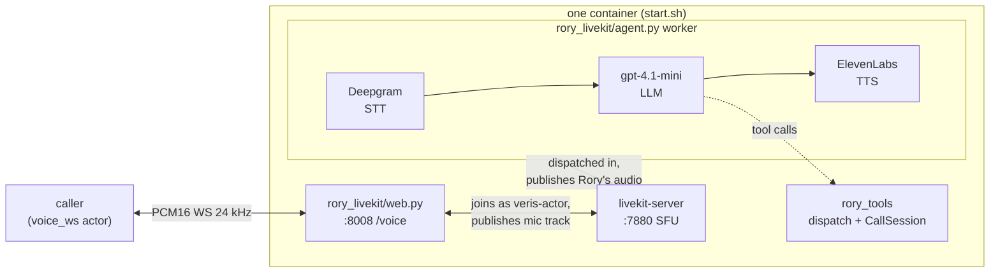

# rory-livekit

Rory, a customer-service voice agent for Acme Energy, built on
[LiveKit Agents](https://docs.livekit.io/agents/) with a **cascaded pipeline —
Deepgram STT, an OpenAI `gpt-4.1-mini` chat LLM, and ElevenLabs TTS**. Rory
explains bills, takes payments, and sets up payment arrangements end to end,
calling **two real vendor APIs** — Stripe for billing and Apache Fineract for
payment arrangements. Rory runs as a LiveKit `AgentServer` worker inside a
LiveKit room; a small in-container bridge translates Veris's `voice_ws` channel
(raw PCM16 over a plain WebSocket) into that room.

LiveKit is WebRTC end to end, so it cannot speak `voice_ws` directly. This is
the one implementation whose image runs more than one process.

Only the transport lives here. The tools, the vendor clients, the verification
gate and the system prompt are shared with the other implementations and live
at the repo root — see the layout section in the [root README](../README.md).

## What it does

Three processes run inside one container, launched in order by `start.sh`:

1. **`livekit-server`** — the SFU, on `localhost:7880` (dev mode,
   `devkey`/`secret`).
2. **`python -m rory_livekit.agent start`** — the LiveKit Agents worker.
   `RoryAgent` runs a cascaded `AgentSession` (Deepgram STT → `gpt-4.1-mini` →
   ElevenLabs TTS, with Silero VAD), greets first with the shared `GREETING`,
   and carries Rory's 16 tools as raw-schema function tools. The worker is
   dispatched into every room that gets created.
3. **`uvicorn rory_livekit.web:app`** — the `voice_ws` bridge at `WS /voice`
   (plus `/health`) on `:8008`. Each connection creates a room `veris-<rand>`,
   joins as `veris-actor`, publishes the caller's PCM16 as a mic track, and
   forwards the agent's audio back — re-sliced from LiveKit's 10 ms frames to
   the caller's 20 ms frames.



## Why the startup order matters

The worker can only be dispatched into a room that already exists, and the room
is created when a caller opens `/voice`. If the worker has not registered with
the SFU yet, the bridge waits for an agent track that never comes. `start.sh`
therefore starts the SFU, waits for `:7880`, starts the worker, waits for its
`registered worker` log line, and only then brings up the bridge. The bench
polls `/health` for readiness, so "healthy" means "can answer". If the worker
never registers, the boot fails rather than opening a bridge with nobody behind
it.

## How this differs from the Pipecat cascade

- **Tool calls are one per step.** LiveKit runs a batch of tool calls
  concurrently; Rory's tools share verification and payment state, so the
  OpenAI LLM is created with `parallel_tool_calls=False` and each call runs,
  and is observed, in order.
- **`max_tool_steps` is raised to 10.** LiveKit forces a spoken reply with
  tools disabled once a turn has chained three tool steps; the other
  candidates chain freely, and a verify → account → bills → explain turn is
  already four.
- **Endpointing is pure silence, pinned to 0.8 s** — the same effective
  end-of-turn silence as the Pipecat and Gemini candidates. No turn-detector
  plugin; the effective endpoint is max(Silero `min_silence_duration`,
  endpointing `min_delay`), so both are 0.8.
- **The worker never self-throttles.** `AgentServer(load_fnc=lambda *_: 0.0)`
  disables the prod-mode CPU load threshold, which trips when the SFU, worker
  and bridge share one CPU-bound container.
- **One `CallSession` per call** rides on `AgentSession(userdata=...)` and is
  read by every tool handler as `context.userdata`, the LiveKit equivalent of
  Pipecat's `app_resources`.

## Running it

```bash
cd /path/to/rory-agent
docker build --platform linux/amd64 -f livekit/Dockerfile -t rory-livekit .
```

Run the image with the provider keys in its environment; it serves `/voice`
and `/health` on `:8008`. `LIVEKIT_URL=ws://localhost:7880`,
`LIVEKIT_API_KEY=devkey` and `LIVEKIT_API_SECRET=secret` are the defaults for
the in-container SFU. Allow a minute of readiness: the worker registers with
the SFU before the bridge opens `:8008`.

## Tests

```bash
cd .. && uv run pytest livekit/tests -q     # this transport's parity run
cd .. && uv run pytest -q                   # the whole workspace
```

## Wire protocol (caller ↔ /voice)

Binary WebSocket frames carrying raw PCM16 audio:

| Property      | Value                                 |
|---------------|---------------------------------------|
| Sample rate   | 24,000 Hz                             |
| Sample format | signed 16-bit little-endian (`s16le`) |
| Channels      | mono                                  |
| Frame size    | 20 ms (960 bytes) out; passthrough in |
| End of call   | either side closes the WS             |

## Environment

| Variable               | Required | Default                | Notes |
|------------------------|----------|------------------------|-------|
| `OPENAI_API_KEY`       | yes      | —                      | the `gpt-4.1-mini` chat LLM |
| `DEEPGRAM_API_KEY`     | yes      | —                      | Deepgram STT |
| `ELEVENLABS_API_KEY`   | yes      | —                      | ElevenLabs TTS (passed explicitly; the plugin's own default is `ELEVEN_API_KEY`) |
| `STRIPE_API_KEY`       | yes      | —                      | the Stripe twin's fixture key |
| `STRIPE_API_BASE`      | bench    | `api.stripe.com`       | the Stripe twin, injected by the bench |
| `FINERACT_API_BASE`    | yes      | —                      | the Fineract twin, injected by the bench |
| `RORY_REFERENCE_TIME`  | bench    | wall clock             | the World's frozen instant; every date decision reads it |
| `FINERACT_USER`        | no       | `mifos`                | Fineract HTTP Basic user |
| `FINERACT_PASSWORD`    | no       | `password`             | Fineract HTTP Basic password |
| `FINERACT_TENANT`      | no       | `default`              | the required tenant header |
| `LIVEKIT_URL`          | no       | `ws://localhost:7880`  | the in-container SFU |
| `LIVEKIT_API_KEY`      | no       | `devkey`               | dev-mode SFU key |
| `LIVEKIT_API_SECRET`   | no       | `secret`               | dev-mode SFU secret |
| `PORT`                 | no       | `8008`                 | voice_ws bridge port |
| `LLM_MODEL`            | no       | `gpt-4.1-mini`         | chat LLM override |
| `DEEPGRAM_MODEL`       | no       | `nova-3-general`       | STT model override |
| `ELEVENLABS_VOICE_ID`  | no       | `EXAVITQu4vr4xnSDxMaL` | ElevenLabs voice |
| `ELEVENLABS_TTS_MODEL` | no       | `eleven_flash_v2`      | ElevenLabs TTS model |
