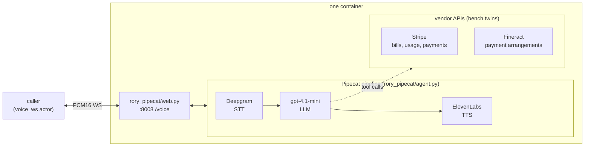

# rory-pipecat

Rory, a customer-service voice agent for Acme Energy, built on
[Pipecat](https://docs.pipecat.ai/) with a **cascaded pipeline — Deepgram STT,
an OpenAI `gpt-4.1-mini` chat LLM, and ElevenLabs TTS**. Rory explains bills,
takes payments, and sets up payment arrangements end to end, calling **two real
vendor APIs** — Stripe for billing and Apache Fineract for payment
arrangements. The pipeline terminates a `voice_ws` channel (raw PCM16 over a
plain WebSocket) directly — no SFU, no WebRTC, no separate bridge process.

Only the transport lives here. The tools, the vendor clients, the verification
gate and the system prompt are shared with the
other implementations and live at the repo root — see the layout section in the
[root README](../README.md).

## What it does

One process runs inside the container: uvicorn serving `rory_pipecat/web.py`, which
exposes `WS /voice` (plus `/health`) on `:8008`. Each `/voice` connection gets
its own Pipecat pipeline (`rory_pipecat/agent.py`):

```
transport.input() → Deepgram STT → user_aggregator → gpt-4.1-mini → ElevenLabs TTS
→ transport.output() → assistant_aggregator
```

Rory greets first, then handles the call with 16 tools.

**The agent code does not know which task it is serving.** Rory calls
Stripe with the real `stripe` SDK and a Fineract server with Fineract's
real credentials and tenant header; the bench points those two clients at its
twins through `STRIPE_API_BASE` and `FINERACT_API_BASE` and nothing else. Who is calling, and why, Rory learns from the caller.

| Area | Tools |
|------|-------|
| **Identity** | `verify_caller` |
| **Account** | `get_account`, `get_supplier_info`, `set_paperless_billing` |
| **Billing** | `list_bills`, `get_bill`, `explain_bill`, `compare_bills`, `get_payment_history` |
| **Payment** | `make_payment`, `request_due_date_extension` |
| **Arrangements** | `quote_payment_arrangement`, `create_payment_arrangement`, `get_payment_arrangement`, `modify_payment_arrangement` |
| — | `transfer_to_human` |

`quote_payment_arrangement` exists so disclosure is measurable: a down payment
the caller was never told about is a failure, and the trace shows whether the
quote came before the enrolment.

### The agent sees a CIS, not two vendors

Rory's tools are a **single utility-shaped facade**. The agent calls
`get_account` and `explain_bill`; it never sees Stripe or Fineract and could
not tell this apart from a utility's own customer information system. The
mapping is in [`../rory_tools/services/__init__.py`](../rory_tools/services/__init__.py).

The split behind it is not a compromise — real utilities genuinely run billing
and payment arrangements in separate subsystems, and keeping the two consistent
is exactly the cross-system reasoning this agent exists to test.



### Why usage lives in line metadata

The obvious modelling of a metered bill is a Price with a per-kWh `unit_amount`
and `quantity` = kWh. It does not survive contact with the money: a residential
supply rate is 8.94 cents per kWh, and the input that expresses fractional unit
amounts (`unit_amount_decimal`) is not one every Stripe-compatible backend supports.

So each bill segment is a flat `amount`, with `kwh` and `rate_cents_per_kwh`
in `metadata` and a human-readable `description`. The agent gets structured
usage, and the money stays exact.

## The policy Rory has to get right

The interesting part of this agent is not the happy path — it is the set of
requests where the correct answer is a refusal, a disclosure, or an escalation.

| Rule | Enforced by |
|------|-------------|
| A repayment cannot be dated in the future — a promise is not a payment | Fineract |
| A loan cannot be disbursed before it is approved | Fineract |
| An account number matches exactly and case-sensitively | Fineract (`externalId`) |
| A card with no funds declines | Stripe |
| A paid bill cannot be paid again | Stripe |
| An arrangement needs at least $50 of arrears; the longest term follows the household's income tier (6 months with no income on record, up to 60) | `policy.py` |
| A plan broken in the last 12 months requires 25% down | `policy.py` |
| Winter protection and medical certificates are stated as facts, never as a reason to keep a shutoff call | `policy.py` |
| A due-date extension is at most 15 days, once per 12 months | `policy.py` |
| An account ≥ $500 and ≥ 60 days late is in **severance** and goes to a human | `policy.py` |
| A bill's change splits into usage, rate, and period effects that sum exactly | `policy.py` |
| Verify the caller before revealing anything or changing anything | `rory_tools/impl.py`, `rory_tools/dispatch.py` |
| A bill belonging to another account is never readable | `rory_tools/impl.py` |
| **Never accept a card number, CVV, or bank details by phone** | the prompt |
| The down payment must be disclosed *before* enrolling | the prompt |
| A declined payment must be reported as a failure, never as success | the prompt |
| A shutoff account is transferred, never negotiated with | the prompt |

## The world

Rory runs against the Acme Energy world: one Stripe twin and one Fineract
twin, built through the vendors' own APIs, captured as a frozen-clock
snapshot and cloned fresh for every attempt. The code relies on the world's
shape only: which metadata keys carry the account number and the
cross-system link, how a bill's line items are shaped, which loan product an
arrangement is opened on. Nothing in the world says which task an attempt is
serving; Rory learns who is calling from the caller.

The development seed has ten memorable accounts (Alice through Jonah; see
`tests/test_integration.py`). Carmen is the one worth watching: her bill went up while her usage went down, so an agent
reasoning from the two totals tells her she used more energy, which is the
opposite of true.

## Run it on Veris Bench

The bench runs this container directly: no config file, no DNS interception.
It injects the twins' base URLs and the frozen clock (`RORY_REFERENCE_TIME`),
polls `GET /health` on `:8008`, and opens the `voice_ws` session at `/voice`.

```bash
cd /path/to/rory-agent
docker build --platform linux/amd64 -f Dockerfile.bench -t rory-bench .
```

Run the image with `RORY_AGENT_APP=rory_pipecat.web:app` and the provider keys
in its environment. The image also carries the Gemini Live transport; the
variable selects which one boots. Run `uv run pytest -q` before building;
the parity suite checks their shared schemas and instructions. Docker builds
check imports and prompt packaging, but do not run pytest.

## Tests

The suite lives at the repo root, because most of what it covers is shared
with the other implementations:

```bash
cd .. && uv run pytest -q                    # local suite; live-twin tests skip
```

`tests/test_integration.py` exercises `rory_tools.dispatch` — the code path
every transport runs — against live twins, and skips without
`STRIPE_API_KEY`. Run it under the proxy so the receipt and the verdict come
from one run:

```bash
cd /path/to/rory-agent
docker build -f Dockerfile.veris -t rory-core:veris .
veris-proxy run --sandbox <id> --image rory-core:veris --patch-bundled-cas \
  -e STRIPE_API_KEY=... -e FINERACT_USER=mifos -e FINERACT_PASSWORD=password \
  --require-service stripe --require-service fineract \
  -- uv run --no-sync python -m pytest tests/test_integration.py -q
```

## Wire protocol (caller ↔ /voice)

Binary WebSocket frames carrying raw PCM16 audio:

| Property      | Value                                 |
|---------------|---------------------------------------|
| Sample rate   | 24,000 Hz                             |
| Sample format | signed 16-bit little-endian (`s16le`) |
| Channels      | mono                                  |
| Frame size    | passthrough in both directions        |
| End of call   | either side closes the WS             |

## Environment

| Variable               | Required | Default                | Notes |
|------------------------|----------|------------------------|-------|
| `OPENAI_API_KEY`       | yes      | —                      | the `gpt-4.1-mini` chat LLM |
| `DEEPGRAM_API_KEY`     | yes      | —                      | Deepgram STT |
| `ELEVENLABS_API_KEY`   | yes      | —                      | ElevenLabs TTS |
| `STRIPE_API_KEY`       | yes      | —                      | the Stripe twin's fixture key |
| `STRIPE_API_BASE`      | bench    | `api.stripe.com`       | the Stripe twin, injected by the bench |
| `FINERACT_API_BASE`    | yes      | —                      | the Fineract twin, injected by the bench |
| `RORY_REFERENCE_TIME`  | bench    | wall clock             | the World's frozen instant; every date decision reads it |
| `FINERACT_USER`        | no       | `mifos`                | Fineract HTTP Basic user |
| `FINERACT_PASSWORD`    | no       | `password`             | Fineract HTTP Basic password |
| `FINERACT_TENANT`      | no       | `default`              | the required tenant header |
| `LLM_MODEL`            | no       | `gpt-4.1-mini`         | chat LLM override |
| `DEEPGRAM_MODEL`       | no       | `nova-3-general`       | STT model override |
| `ELEVENLABS_VOICE_ID`  | no       | `EXAVITQu4vr4xnSDxMaL` | ElevenLabs voice |
| `ELEVENLABS_TTS_MODEL` | no       | `eleven_flash_v2`      | ElevenLabs TTS model |
