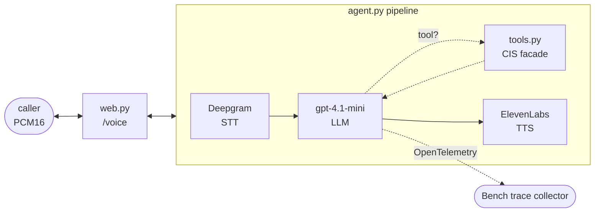

# rory_pipecat

The Pipecat transport for Rory: the pipeline that carries the call, the FastAPI
server that terminates the `voice_ws` WebSocket, the PCM16 serializer, and a
thin adapter that hands Rory's shared tools to Pipecat.

Everything the agent *does* — the 16 tools and their implementations, the
vendor clients, the verification gate, the Acme Energy policy, the system
prompt — lives in [`rory_tools`](../../rory_tools/) and is
shared unchanged with every other implementation. This package is only the
transport, and that boundary is enforced by
[`tests/test_parity_pipecat.py`](../tests/test_parity_pipecat.py).

The container startup and how to run a simulation live in the
[implementation README](../README.md); this doc is about the code.

| Module | Role |
|--------|------|
| `agent.py` | The Pipecat pipeline. Deepgram STT → `gpt-4.1-mini` → ElevenLabs TTS with Silero VAD turn-taking, and `run_voice_ws_bot`, the per-connection entry point. |
| `tools.py` | The Pipecat adapter: turns each shared `ToolSchema` into a `FunctionSchema`, and wraps `rory_tools.dispatch` in a `FunctionCallParams` handler. No tool logic of its own. |
| `web.py` | A FastAPI app exposing `WS /voice` (and `/health`) on `:8008`. Hands each accepted WebSocket to `run_voice_ws_bot`. No agent logic — pure transport. |
| `serializers.py` | `RawPCM16Serializer` — the trivial bytes ↔ frame mapping for the raw PCM16/24 kHz `voice_ws` wire protocol. |

`__init__.py` is empty — this is a plain namespace package, started as
`uvicorn rory_pipecat.web:app` when `RORY_AGENT_APP` names it.

## How one call flows through the package

## The facade is the point

Rory's tools are a **single utility-shaped facade** rather than a thin wrapper
over each vendor's own shapes. The agent calls
`get_account`, `explain_bill`, `create_payment_arrangement`. It never sees
Stripe or Fineract, never learns that a bill id is an invoice id, and could not
tell this apart from a utility's own customer information system.

That is deliberate. A utility's agent talks to one system in utility nouns; the
fact that this one is composed from two vendor twins is a property of the
*environment*, not something to make the model reason about. The object-model
mismatch between "Stripe customer" and "utility account" exists only at a layer
the agent does not look at.

| Utility noun | Backed by |
|---|---|
| Account | Stripe customer — `metadata` carries the account number, paperless flag, supplier |
| Service agreement / premise | Stripe subscription — `metadata` carries premise id, service address, meter |
| Bill | Stripe invoice |
| Bill segment | Invoice line item |
| Metered usage | Line `metadata`: `kwh`, `rate_cents_per_kwh`, read dates |
| Payment arrangement | Fineract loan (zero interest) |
| Arrangement instalment | Fineract loan transaction |

## Where the policy lives

Split three ways, deliberately.

**The vendors enforce what they own.** Stripe declines a card that has no
funds and refuses to pay an invoice twice. Fineract refuses a repayment dated
in the future and refuses a command against the wrong loan state. Nothing here
re-implements that — the refusal arrives as a vendor error the model has to
read and explain.

Three of those refusals do real work:

- **a future-dated repayment is refused**, so a caller's "I'll pay Friday" cannot
  be recorded as a payment;
- **a wrong-state command is a 400**, so an arrangement nobody approved cannot be
  disbursed;
- **`externalId` matching is exact and case-sensitive**, so a near-miss account
  number finds nobody rather than fuzzily finding somebody.

**`policy.py` decides what no vendor knows.** Neither Stripe nor Fineract has
heard of a utility. Arrangement eligibility, the 25% down payment after a
broken plan, the 15-day extension cap, and the severance threshold are Acme
Energy's own rules, checked in Python against account state.

`policy.py` also owns `explain_variance`, which is not a rule but arithmetic
the model should not be doing in its head: the standard price/volume split of
the change between two bills into a usage effect, a rate effect, and a
remainder. The three always sum to the actual difference, so the agent cannot
read out a decomposition that does not add up — and cannot tell a caller they
used more energy on a month when they used less.

**Identity is enforced, not judged.** `verify_caller` checks the caller's three
answers inside the tool and returns a bare boolean; the account it matched
stays on the `CallSession` and never enters the transcript. That session is
Pipecat's own per-call state — `PipelineTask(app_resources=CallSession())`,
read back in every handler as `params.app_resources` — so it is scoped to one
call by the framework rather than by anything this app remembers to do. Every
tool that touches account data reads its subject from there, so there is no
account id for the model to supply, and no way to talk it into supplying
someone else's.

Bill ownership is checked the same way and for the same reason: Stripe returns
any invoice to a valid API key, so `_owned_bill` refuses one that is not on the
verified caller's account. Without that, a hallucinated id reads out a
stranger's bill and looks like a successful lookup in the trace.

**The model owns the rest of the judgement.** Whether the down payment was
disclosed *before* enrolling, whether the variance was attributed to the right
driver, whether a declined payment was reported as a failure, whether a shutoff
account was escalated rather than negotiated with, and whether Rory ever
solicited a card number — none of these are enforced anywhere in the code,
because enforcing them would make them impossible to measure.

## The seam between the two systems

Stripe holds the bill; Fineract holds the arrangement. Nothing in either vendor
guarantees they agree — which is realistic, because real utilities do run
billing and collections in separate subsystems.

The seam is not hidden, but it *is* enforced, in one place:
`create_payment_arrangement` reads the arrears from Stripe at the moment of
enrolment and opens the Fineract loan at exactly that principal. An arrangement
whose amount does not match the balance it is meant to clear is worse than no
arrangement, and no vendor can catch it.

## Tool results are always non-empty dicts

Pipecat's aggregator only re-runs the LLM after a tool call `if frame.result:`.
A falsy result (`{}`) means the agent never speaks again and the call deadlocks
to the simulation timeout. So a miss returns `{"error": "…"}` rather than `{}`,
and the list tools wrap their possibly-empty list in a named key
(`{"bills": []}`).

## Money is in cents

Every amount crossing the tool boundary is an integer number of cents, and
every tool description says so. Dollars-versus-cents is a live failure mode for
an agent that also has to read the amount aloud, and it is one worth catching
in the trace rather than designing away.

The one exception is the Fineract boundary, which takes major units (dollars).
That conversion happens once, inside `fineract_client.py`, at the boundary that
requires it — never in the tool layer and never in the prompt.
