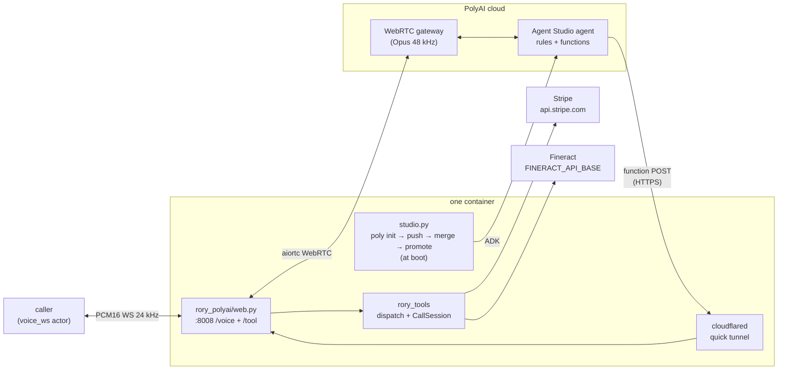

# rory-polyai

Rory, a customer-service voice agent for Acme Energy, built on **PolyAI Agent
Studio** — a hosted platform: ASR, the agent, TTS and turn-taking all run on
PolyAI's side, and the agent itself is *project configuration* (persona,
rules, greeting, Python functions) rather than code this image runs. Rory
explains bills, takes payments, and sets up payment arrangements end to end,
calling **two real vendor APIs** — Stripe for billing and Apache Fineract for
payment arrangements. The agent terminates a `voice_ws` channel (raw PCM16
over a plain WebSocket) and bridges it onto PolyAI's WebRTC gateway, the same
gateway PolyAI's browser web-calling widget uses.

PolyAI has no per-call agent definition and no client-tool round trip. The
[ADK](https://polyai.github.io/adk/) is the only write path to a project, so
this transport pushes Rory onto an Agent Studio project **at boot**, with the
16 tools rendered as Agent Studio functions whose bodies POST back to this
process. What this implementation adds is the provisioning, the WebRTC
bridge, the webhook, and the public URL the webhook needs.

Only the transport lives here. The tools, the vendor clients, the verification
gate and the system prompt are shared with the other implementations and live
at the repo root — see the layout section in the [root README](../README.md).

## What it does

One process runs inside the container: uvicorn serving `rory_polyai/web.py`,
which exposes `WS /voice`, `POST /tool` and `/health` on `:8008`.

At boot, before `/health` answers:

1. `rory_tools/tunnel.py:public_base_url` opens a `cloudflared` quick tunnel
   to `:8008` (or takes `PUBLIC_BASE_URL` as given).
2. `studio.py:provision` runs `poly init` on a fresh copy of the project,
   overlays Rory — `agent_settings/persona.txt`, `rules.txt` (the shared
   prompt, the frozen-clock date context, and a `{{fn:...}}` binding per
   tool), the shared greeting in `voice/configuration.yaml`, barge-in on, and
   one `functions/<tool>.py` per shared tool rendered by `tools.py` with this
   boot's webhook URL baked in — then `poly push`, merges the working branch
   push opens back into `main`, and promotes `sandbox → pre-release → live`.
   The gateway connects calls to the live deployment. This takes about 45 s.

Each `/voice` connection then dials the WebRTC gateway with `aiortc`:
WebSocket signaling (offer with the project's connector token, answer,
trickled ICE), then bidirectional Opus audio. The caller's PCM16 is fed
through a paced virtual microphone track; Rory's decoded reply audio is
resampled back to 24 kHz PCM16. The platform speaks the greeting as soon as
the call connects, so Rory speaks first.

When the model calls a tool, PolyAI runs the rendered function in its cloud,
which POSTs `{"name", "args", "conversation_id"}` to `/tool`. The webhook
keeps one `CallSession` per PolyAI conversation id, runs the call through
`rory_tools.dispatch` under that conversation's lock, and answers with the
result as JSON, which the function returns to the model as context.



## What Agent Studio cannot say

Two parts of the shared tool declaration have no expression in an Agent
Studio function, and the parity run pins them as strict expected failures
rather than hiding them:

- **No optional parameters.** Every parameter is required with no default.
  `modify_payment_arrangement.payment_date` is therefore declared required;
  the rendered body drops it from the envelope when the model passes an empty
  string, and the description already says "Omit for today".
- **Type and description only.** `make_payment.amount_cents` carries
  `minimum: 1` in the shared schema; the platform has nowhere to put it. The
  shared implementation refuses a non-positive amount anyway.

Turn-taking is the platform's. The ADK exposes barge-in (set on) and an ASR
latency/accuracy style (left at `balanced`), not an end-of-turn silence
threshold, so the benchmark's ~0.8 s standard is not pinned here.

## One project, one call at a time

The webhook URL is baked into the pushed functions and is unique per pod, so
**two pods sharing one Agent Studio project overwrite each other's URL**: the
last boot wins and the other pod's tool calls land on the wrong process. Run
one call at a time, or give each concurrent attempt its own project.

## Configuration

| Variable | Required | Default | Notes |
| --- | --- | --- | --- |
| `POLY_ADK_KEY` | yes | | ADK API key; the in-container `poly` CLI pushes Rory with it. |
| `POLYAI_AUTH_TOKEN` | yes | | The project's connector token, sent as `authToken` in the WebRTC signaling offer. PolyAI provisions it per project; it is the same token the SIP connector uses. |
| `POLYAI_ACCOUNT_ID` | yes | | From the Studio URL `https://studio.poly.ai/<account_id>/<project_id>/…`. |
| `POLYAI_PROJECT_ID` | yes | | Use a dedicated, empty project: every boot overwrites its persona, rules, greeting and functions and promotes it to live. |
| `POLYAI_REGION` | no | `us-1` | `studio` for self-serve accounts; enterprise clusters `us-1`, `euw-1`, `uk-1`. Also picks the gateway host. |
| `POLYAI_GATEWAY_URL` | no | (from region) | Full `wss://…/api/v1/webrtc/signal` URL, when the cluster's gateway host is not the one mapped for the region. |
| `STRIPE_API_KEY` | yes | | Shared with every transport; the bench injects a sandbox fixture. |
| `PUBLIC_BASE_URL` | no | | Absolute `https://` URL already routed to `:8008`. When set, no tunnel is spawned. |

The bench also injects `STRIPE_API_BASE` and `FINERACT_API_BASE`, which the
shared vendor clients honor. Voice selection is project-level Studio
configuration the ADK does not author; pick the project's voice in Agent
Studio.

## Running it

```
docker build --platform linux/amd64 -f polyai/Dockerfile -t rory-polyai .
```

The image serves `/voice` and `/health` on `:8008`. Readiness takes about a
minute: the tunnel and
the push-and-promote both happen before `/health` first answers.

## Running the tests

```bash
uv run pytest polyai/tests
```

The parity run parses the rendered function files back and checks them
against the shared surface (with the two platform limits above as strict
xfails). The lifecycle tests execute a rendered function against a stub of the
ADK's `_gen` namespace, check the project overlay and the `poly` command
sequence, the per-conversation webhook sessions, the paced microphone track
and the signaling offer. The WebRTC media legs and the hosted turn model need
a live call and a connector token.

## Known limits

- The connector token is provisioned by PolyAI rather than created in Studio.
  Everything up to the audio (push, promote, functions, webhook) can be
  exercised without it, with
  `poly chat --environment live --channel voice --functions`.
- Quick tunnels are free and unauthenticated; Cloudflare rate-limits them per
  egress IP. Many parallel attempts from one egress IP may see slow
  tunnel start-up, which surfaces as a readiness timeout rather than a bad
  call.
- The rendered function's `urlopen` raises on a non-2xx and the model is left
  with nothing to say, so the webhook always answers 200; a refusal from the
  shared gate is already `{"error": ...}` content the model relays.
