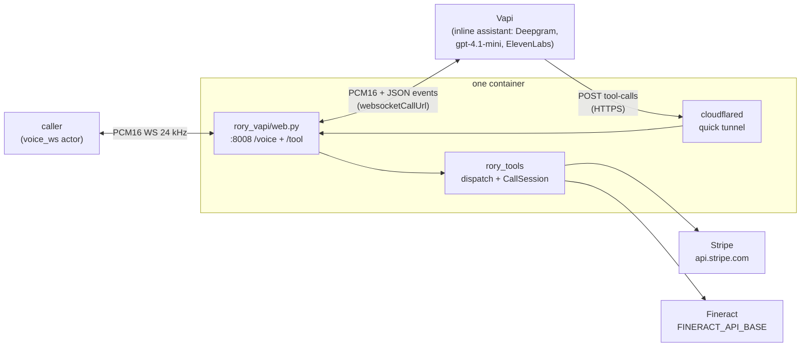

# rory-vapi

Rory, a customer-service voice agent for Acme Energy, built on **Vapi** — a
hosted orchestrator: the transcriber (Deepgram `nova-3`), the `gpt-4.1-mini`
LLM, ElevenLabs TTS and turn-taking all run on Vapi's side for a call created
over its API. Rory explains bills, takes payments, and sets up payment
arrangements end to end, calling **two real vendor APIs** — Stripe for billing
and Apache Fineract for payment arrangements. The agent terminates a `voice_ws`
channel (raw PCM16 over a plain WebSocket) directly — no SFU, no WebRTC, no
phone number.

Unlike the [ElevenLabs implementation](../elevenlabs/), Vapi has no client-tool
round trip that carries a result back to the model: a tool without a server
URL is a notification only. So Rory's 16 tools are registered as **server
tools**, Vapi POSTs each call to this process over HTTPS, and this process
answers from the shared dispatcher. What this implementation adds is the
per-call assistant, the `voice_ws` bridging, the webhook, and the public URL
the webhook needs.

Only the transport lives here. The tools, the vendor clients, the verification
gate and the system prompt are shared with the other implementations and live
at the repo root — see the layout section in the [root README](../README.md).

## What it does

One process runs inside the container: uvicorn serving `rory_vapi/web.py`,
which exposes `WS /voice`, `POST /tool` and `/health` on `:8008`.

At boot, `rory_tools/tunnel.py:public_base_url` opens a `cloudflared` quick tunnel to
`:8008` and reads back its `trycloudflare.com` hostname. This happens before
`/health` answers, so a pod that cannot get a tunnel fails readiness rather
than each call. `PUBLIC_BASE_URL`, when set, is used instead and no tunnel is
spawned.

Each `/voice` connection then creates one Vapi call — an inline assistant
carrying the shared prompt plus the frozen-clock date context, `firstMessage`
set to the shared greeting, the 16 tools pointed at `<public url>/tool`, and
24 kHz `pcm_s16le` on the WebSocket transport — registers a fresh
`CallSession` under the call's id, dials the `websocketCallUrl` Vapi returns,
and pumps audio in both directions. Rory speaks first.

When the model calls a tool, Vapi POSTs a `tool-calls` envelope to `/tool`.
The webhook looks the call up by id, runs each call in order through
`rory_tools.dispatch` under that call's lock, and answers with one JSON-string
`result` per call. A webhook for a call this process did not create is
refused with 404.



## The agent trace

The model runs on Vapi's side, so the agent trace has to be read off the
call's socket: caller and agent transcripts, `tool-calls`, and each server
tool's result from `conversation-update`. `tool-calls-result` is subscribed
too but was never seen on this transport, which is why `conversation-update`
is in `clientMessages`.

## Turn-taking

Pinned to the benchmark's ~0.8 s end-of-turn standard:
`transcriptionEndpointingPlan.onPunctuationSeconds: 0.6` (its countdown starts
once the transcript lands, ~250 ms after speech stops), barge-in after 2
confidently transcribed words, and Vapi's background denoising off for parity
with the other candidates. `maxTokens` is raised to 500 because Vapi's default
of 250 truncates longer tool results.

## Configuration

| Variable | Required | Default | Notes |
| --- | --- | --- | --- |
| `VAPI_API_KEY` | yes | | Private key. Creates calls; Vapi bills them and runs STT/LLM/TTS under its own provider accounts. |
| `STRIPE_API_KEY` | yes | | Shared with every transport; the bench injects a sandbox fixture. |
| `PUBLIC_BASE_URL` | no | | Absolute `https://` URL already routed to `:8008`. When set, no tunnel is spawned. |
| `VAPI_MODEL_PROVIDER`, `VAPI_MODEL` | no | `openai`, `gpt-4.1-mini` | |
| `VAPI_TRANSCRIBER_PROVIDER`, `VAPI_TRANSCRIBER_MODEL` | no | `deepgram`, `nova-3` | Must be a transcriber without its own end-of-turn model, or Vapi ignores the endpointing plan. |
| `VAPI_VOICE_PROVIDER`, `VAPI_VOICE_ID`, `VAPI_VOICE_MODEL` | no | `11labs`, `EXAVITQu4vr4xnSDxMaL`, `eleven_flash_v2` | |

The bench also injects `STRIPE_API_BASE` and `FINERACT_API_BASE`, which the
shared vendor clients honor.

## Running the tests

```bash
uv run pytest vapi/tests
```

The parity run checks the declarations `build_tools` hands Vapi against the
shared surface; the lifecycle tests cover the payload, the webhook round trip,
the call registry and the tunnel short-circuit. Audio and the hosted turn
model need a live call.

## Known limits

- Quick tunnels are free and unauthenticated; Cloudflare rate-limits them per
  egress IP. Many parallel attempts from one egress IP may see slow
  tunnel start-up, which surfaces as a readiness timeout rather than a bad
  call.
- Vapi drops any tool `result` that is not a string, and any non-200 webhook
  response, with "No result returned" and nothing in this process's logs.
  `run_tool_calls` always returns strings; keep it that way.
